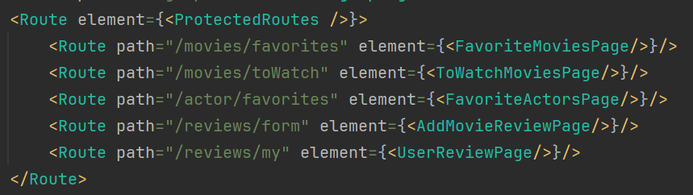
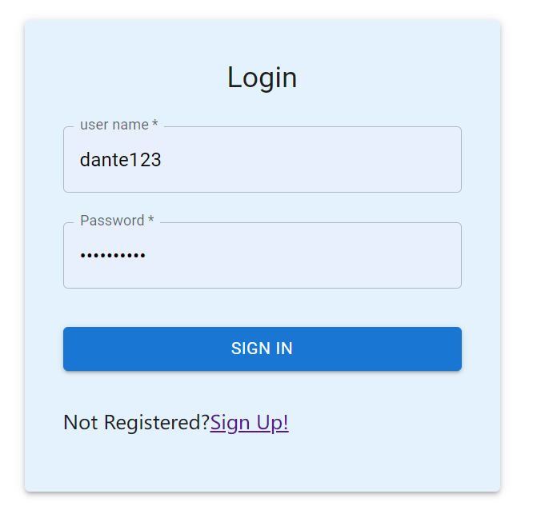
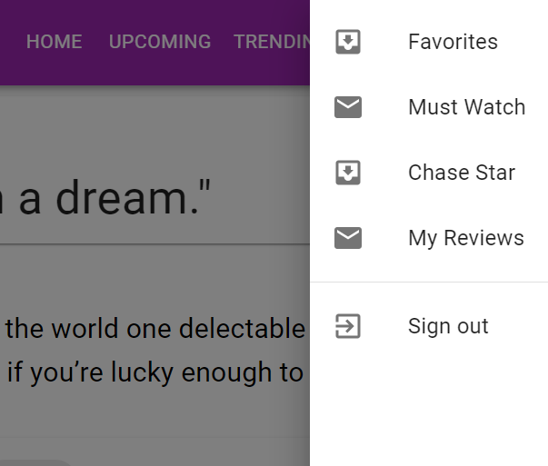
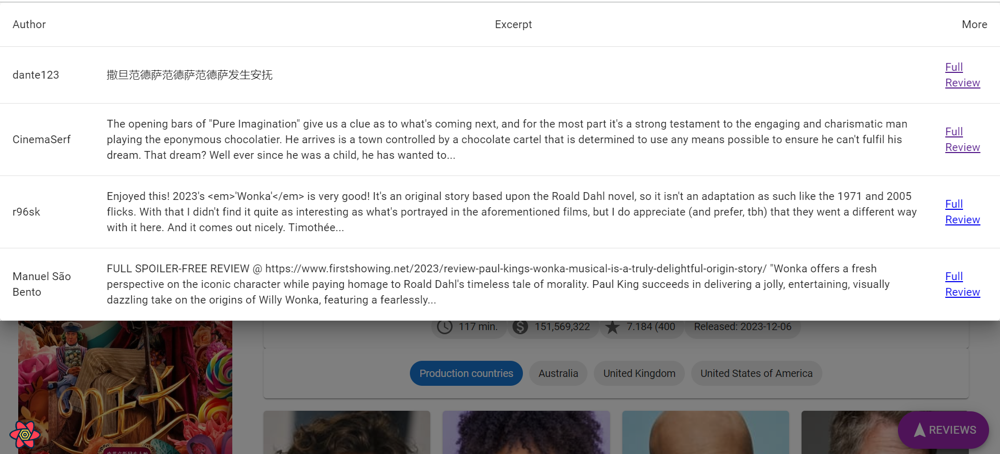

Assignment 2 - Web API.

Name: Jiahan Chen

## Features.

A bullet-point list of the ADDITIONAL features you have implemented in the API **THAT WERE NOT IN THE LABS** (or modifications to existing features)

 + **User login and registration function**: Users can register, and after the registration is completed, the registered information is saved to the database, users can log in at any time. And for the registration and login, add error alerts, so that the user can easily to modify.
 + **User favorite movie**: Users can select their favorite movies and their favorites will be saved to the database and when they log in again that year, they will see their favorite movies.
 + **User Must Watch Movie**: Users can select the films they want to watch, and these records are saved to the back-end database, so that when the user logs in again, he or she will also see the film he or she wants to watch.
 + **User favorite actor**: Users can select their favorite actors, and these records are saved to the back-end database, so that when the user logs in again, he or she will also see his or her favorite actors.
 + **User movie review:** Users can comment on their favorite movies and see other users' comments (both tmdb-api and their own newly created comments), in addition to seeing which movies they have commented on and looking at details and deletions.
 + **Personalized User Integration:** The system integrates user-related content (favorite movies, favorite actors, movies you want to see, personal comments) in one place, making the page more aesthetically pleasing and usable.

## Setup requirements.

[ Outline any non-standard setup steps necessary to run your app locally after cloning the repo.]

```javascript
// backend activate
cd .\movies-api\
npm install
npm run dev
```

```javascript
// frontend activate
cd .\movies\
npm install
npm run start
```

## API Configuration

**In .\movies-api\ dictionary**

create `.env` and configure the file as follows:

REMEMBER: DON'T PUT YOUR OWN USERNAMES/PASSWORDS/AUTH KEYS IN THE README OR ON GITHUB, just placeholders as indicated below:

```
NODE_ENV=development
PORT=8080
HOST=localhost
MONGO_DB=mongodb+srv://<username>:<password>@cluster0.lvrdru0.mongodb.net/?retryWrites=true&w=majority
TMDB_KEY=<your tmdb api key>
SECRET=ilikecake
```

## API Design

SwaggerHub API: https://app.swaggerhub.com/apis/20104725/WebDevApp-CA2/1.0

## Security and Authentication

We are targeting user related pages, including favorite movies, favorite actors, movies to catch up on, and our own reviews. These pages are route-protected so that when we are not logged in, we click on these pages or type in the website, we will be redirected to the login page, and then when we are successfully logged in, we will be automatically redirected to the page we want to enter. The routes we protect this way are:

```
http://localhost:3000/movies/favorites
http://localhost:3000/movies/toWatch
http://localhost:3000/actor/favorites
http://localhost:3000/reviews/my
```



## Integrating with React App

First of all, our login and register page functionality is connected to the Web API, when we click login or click register, we call the POST method of the Web API, and according to whether or not there is a parameter passed into register to determine whether it is registered or logged in. If it is login, we will use JWT technology to pass the token to the front-end.



In addition, our user-related pages, including favorite movies, favorite actors, and movies you want to watch. All of them are directly connected to the Web API, and add (post) delete (delete) check (get) operations have been added.



We use mongoose to create a new review model in the back-end, which stores the new movie reviews created by our users, and adds the operations of add(post), delete(delete), and change(get). And on the front-end, we created a new My Review page, which allows us to see which reviews the user has posted.




Finally, all requests within our front-end `tmdb-api.js` are made to the back-end, and if we need to request the tmdb API, then it is the back-end that makes the request and returns the results to the front-end.

## Independent learning (if relevant)

Learn how to use swagger to write API key.
